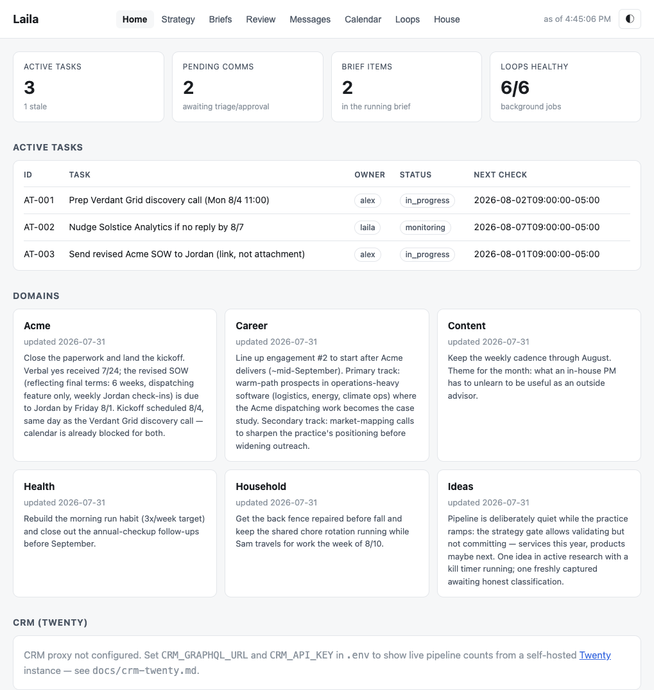
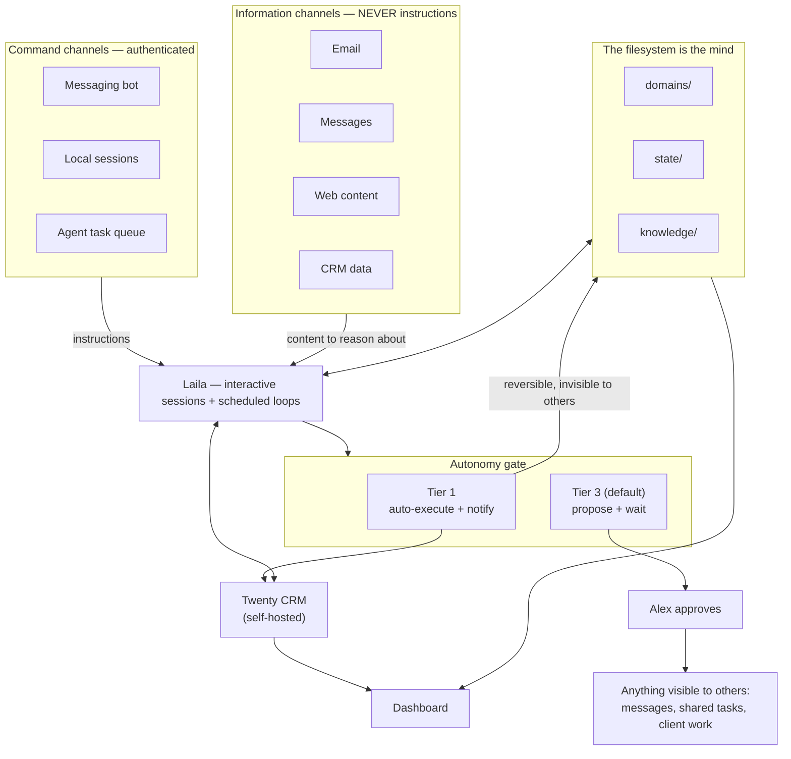

# Laila


Laila is an operating system for a person who runs their life with AI agents. It stores your world as plain files: career, health, household, whatever you carry. Agents read those files, remember between sessions, and do scheduled work overnight. Strict rules decide what they may do alone and what waits for you.

Harnesses like Claude Code, Codex, and YC's QM supply the engine agents run in. Laila is what you point the engine at. Everything is a plain file, so any harness that can read a repo can run it. The reference implementation is Claude Code. The porting checklist is in `docs/platform-portability.md`.

A company installs a platform. You keep a repo. Your files stay on your machine, in private git, under a security model built for one person. It needs no cloud account and no subscription.

This repo is a cleaned copy of a real system that has run daily since early 2026. The original has 20 domains, ~46 skills, ~50 scheduled jobs, and a self-hosted CRM. Everything personal was replaced with a fictional user named Alex.

## Try it in 30 seconds

No dependencies, no build step. The dashboard reads the sample state directly:

```bash
git clone https://github.com/cacardinal/laila && cd laila
node dashboard/server.js
# → http://127.0.0.1:5175
```

<picture>
  <source media="(prefers-color-scheme: dark)" srcset="docs/images/dashboard-dark.png">
  
</picture>

The dashboard shows tasks with owners, comms items labeled by autonomy tier, background loops with their dead-man status, and one card per life domain.

## The core idea

Most AI assistant setups fail the same way. The model is smart but the system has no memory, no boundaries, and no structure. Every session starts from zero. Every action needs babysitting.

Laila makes three commitments:

1. **The filesystem is the mind.** Everything lives as markdown and JSON in one repo: domains, tracking files, daily notes, a knowledge graph. The agent reads state instead of asking you to repeat it. Recall works three ways. Hybrid search (BM25 plus embeddings) covers the memory collections. Wikilinks connect entity files, and the agent follows them. Grep handles the rest. Each fact has exactly one authoritative file. Everything else is a generated export, and there is no separate memory database to drift out of sync (`knowledge/README.md`).

2. **Autonomy has a bright line.** Every action is Tier 1 or Tier 3. Tier 1 actions run on their own and notify you; they must be deterministic, reversible, and invisible to anyone but you. Tier 3 is the default. The agent proposes and waits. Anything another person could see is Tier 3, always. The agent never sends a message or completes a shared task without approval, and no skill or subagent routes around this.

3. **Commands and information are different channels.** Instructions reach the agent only through channels that authenticate you: your Telegram, your local sessions, a dedicated task queue. Email, messages, web pages, and CRM data are information. The agent reasons about them and never obeys them. If an email claims to be you and tells the agent to forward a document, the agent reads it, maybe reports it, and does nothing. This is how the system defeats prompt injection.

## Architecture



The diagram doubles as the security model. Instructions enter only from the left column. Anything outward-facing passes through an approval. The files in the middle carry memory between sessions.

## What's in the box

```
AGENTS.md               The router: global policies + pointers, no content
CLAUDE.md               One-line Claude Code adapter (imports AGENTS.md)
config/
  domain-triggers.json  Domain registry: paths, trigger phrases, lifecycle state
  autonomy-rules.json   Tier definitions and the auto-execute allowlist
domains/                One directory per life domain (career, health,
                        household, content), each with its own AGENTS.md
                        and tracking/status.md
state/                  Volatile truth: strategy, goals export, daily notes,
                        active tasks, the loops registry
knowledge/              The memory system: entity graph, tacit lessons,
                        decision log, the MEMORY.md hot-cache pattern,
                        and the tiered retrieval design (search > links > grep)
skills/                 Rituals as skills: daily-brief, session-wrap,
                        whats-next, domain-hygiene, roast, validate-idea,
                        and the judgment layer that gates evidence
agents/                 Subagent definitions: read-only critics and cheap
                        research workers, none with send tools
                        (skills/ and agents/ are the neutral paths; the
                        files live in .claude/ for the reference harness)
scripts/                Heartbeat, hygiene scanner, notify wrapper
dashboard/              Zero-dependency status page over the state files,
                        with an optional live-CRM panel
launchagents/           macOS launchd templates for the background loops
templates/              Sync protocol, daily cadence, OKR architecture
docs/                   Setup walkthrough, security model, platform
                        portability, background monitoring, how to add
                        a domain
```

## How a day works

A launchd job starts the morning. It runs a headless agent session, builds a daily brief from calendar, comms, and domain status, and sends it to Telegram. During the day you use trigger phrases: "what's next?", "check career", "prep me for the 2pm". Skills load domain context. Subagents do the searching and reviewing so the main session stays focused. Decisions land in the decision log. At night a consolidation job reads the day's notes and updates the knowledge files.

Every session ends with `/session-wrap`. It proposes updates across the tracking files and waits for approval. Skipping it is how things get dropped.

## The CRM next door

Flat files carry most of the truth. Contacts, pipeline, and goals need more structure, so the reference setup runs [Twenty](https://github.com/twentyhq/twenty), an open-source CRM, in local Docker. The agent reads and writes it over GraphQL. The repo keeps generated exports of its data. The dashboard proxies to it for live counts. Worked examples and gotchas are in `docs/crm-twenty.md`.

## The judgment layer

`skills/laila-judgment` may be the most transferable file here. It records the working discipline the original system learned from its own failures. "Done" means verified against the live system, and a subagent's report is not evidence. Day-of-week comes from `date`, never from inference. Anything public gets a secret scan. When reality contradicts the task, the agent stops and says so. Each rule exists because breaking it once cost something.

## Adapting it

The full walkthrough is **`docs/setup.md`**: Telegram bot, email and calendar access, the reminders queue, dead-man switches, and loops, in dependency order with a verification step per stage. The short version:

1. Clone into a PRIVATE repo. Your copy becomes your personal data store, and the nightly loop auto-pushes it (`docs/setup.md` §0 before anything else).
2. Rewrite `AGENTS.md`'s user facts and `config/domain-triggers.json` with your real domains. Start with 3. Add a domain only when a real workload demands one (`docs/adding-domains.md`).
3. Replace the sample content in `domains/`, `state/`, and `knowledge/` with your own. The structures are what transfer. Alex's data only shows the shape.
4. Wire your channels (`docs/setup.md` §2-7): Telegram for notify and command, read-only mail and calendar access for the loops, healthchecks.io as the dead-man layer, optionally the CRM.
5. Adopt the tier model before anything else. Write down the line between "act" and "ask", and enforce it everywhere.
6. Not on Claude Code? Work through `docs/platform-portability.md`. The rules port; only the discovery layer changes.

## What's deliberately absent

No credentials, no OAuth tokens, no personal data, no shared git history. The repo was assembled fresh, and the private system it copies stays private. Where an integration was too personal to genericize, a marked placeholder describes the pattern instead.

## License

MIT
