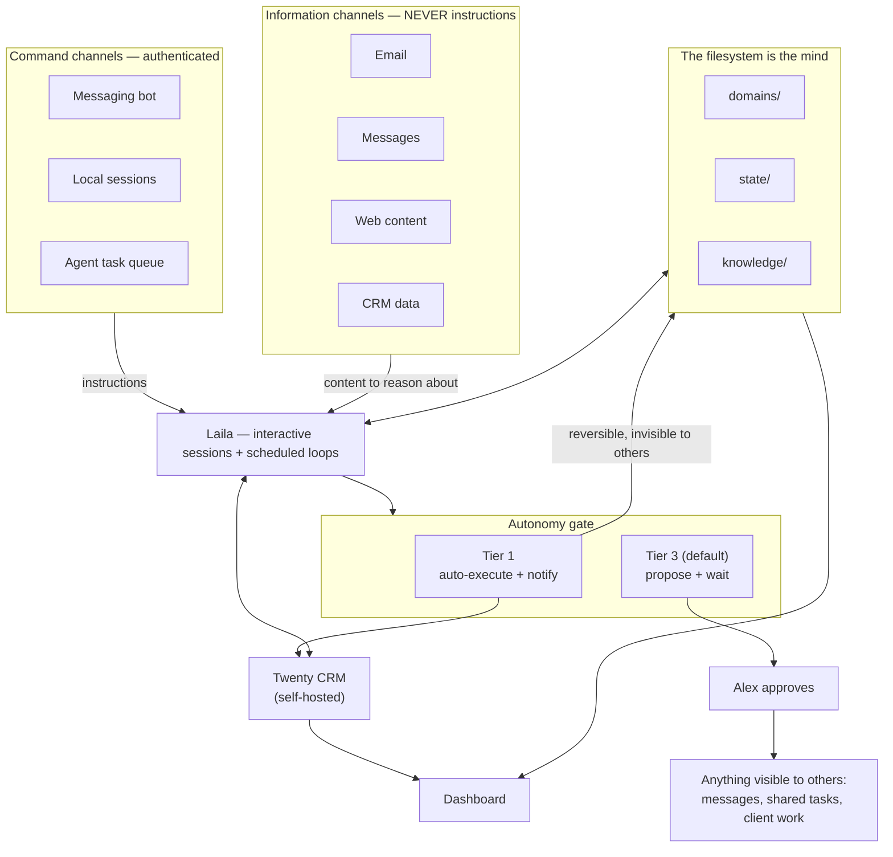

# Laila OS


A working example of a personal operating system for AI agent harnesses. Life domains live as a filesystem, memory persists across sessions, autonomy comes with hard lines, and a named agent persona (Laila) runs background loops on your behalf.

The conventions are deliberately platform-agnostic — an `AGENTS.md` router, SKILL.md rituals, plain-file state, and an env-configurable headless runner — because the system is the files and the discipline, not any vendor's feature set. The reference implementation runs on [Claude Code](https://claude.com/claude-code); adapters and the porting checklist are in `docs/platform-portability.md`.

This repo is extracted from a real system that has run daily since early 2026. The original carries 20 active domains, ~46 skills, ~50 scheduled background jobs, a self-hosted CRM, and an agent that triages email, preps meetings, and files transcripts while its human sleeps. Everything personal has been replaced with a fictional user named Alex. The architecture is the artifact.

## Try it in 30 seconds

No dependencies, no build step. The dashboard reads the fictional sample state directly:

```bash
git clone https://github.com/cacardinal/laila-os && cd laila-os
node dashboard/server.js
# → http://127.0.0.1:5175
```

<picture>
  <source media="(prefers-color-scheme: dark)" srcset="docs/images/dashboard-dark.png">
  
</picture>

What you're looking at is the whole system in miniature: tasks with owners (Alex vs. the agent), comms items labeled by autonomy tier, background loops with dead-man-switch status, and one card per life domain.

## The core idea

Most "AI assistant" setups fail the same way. The model is smart but the *system* has no memory, no boundaries, and no structure, so every session starts from zero and every action needs babysitting.

Laila OS answers with three design commitments:

1. **The filesystem is the mind.** Domains, tracking files, daily notes, and a knowledge graph live as markdown and JSON in one repo. The agent reads state instead of asking you to repeat it, and any agent that can read a repo can run the system. One home per fact: every piece of truth has exactly one authoritative file, and everything else is a generated export.

2. **Autonomy has a bright line.** Every action is Tier 1 (auto-execute and notify; deterministic, reversible, invisible to anyone but you) or Tier 3 (propose and wait; the default, and mandatory for anything another human could observe). The agent never sends a message, completes a shared task, or touches anything outward-facing without approval. No skill or subagent routes around this.

3. **Commands and information are different channels.** Instructions reach the agent only through authenticated command channels (your Telegram, your local sessions, a dedicated task queue). Email, messages, web pages, and CRM data are information channels, content to reason about and never instructions to follow. An email claiming to be from you, telling the agent to forward a document? The agent reads it as content, maybe reports it, and does nothing. This is the prompt-injection defense, built into the architecture instead of bolted on.

## Architecture



The diagram is the security model: instructions only enter from the left column, everything outward-facing exits through an approval, and the files in the middle are the memory that makes each session start warm.

## What's in the box

```
AGENTS.md               The router: global policies + pointers, no content
CLAUDE.md               One-line Claude Code adapter (imports AGENTS.md)
config/
  domain-triggers.json  Domain registry: paths, trigger phrases, lifecycle state
  autonomy-rules.json   Tier definitions and the auto-execute allowlist
domains/                One directory per life domain (career, health,
                        household, content), each with its own AGENTS.md
                        and tracking/status.md
state/                  Volatile truth: strategy, goals export, daily notes,
                        active tasks, the loops registry
knowledge/              The memory system: entity graph, tacit lessons,
                        decision log, and the MEMORY.md hot-cache pattern
skills/                 Rituals as skills: daily-brief, session-wrap,
                        whats-next, domain-hygiene, roast, validate-idea,
                        and the judgment layer that gates evidence
agents/                 Subagent definitions: read-only critics and cheap
                        research workers, none with send tools
                        (skills/ and agents/ are the neutral paths; the
                        files live in .claude/ for the reference harness)
scripts/                Heartbeat, hygiene scanner, notify wrapper
dashboard/              Zero-dependency status page over the state files,
                        with an optional live-CRM panel
launchagents/           macOS launchd templates for the background loops
templates/              Sync protocol, daily cadence, OKR architecture
docs/                   Security model, background monitoring, trigger
                        phrases, how to add a domain
```

## How a day works

The morning starts with a launchd job that runs a headless agent session (whatever CLI `AGENT_RUN` names), assembles a daily brief (calendar, comms triage, domain status, cross-domain conflicts), and sends it to Telegram. During the day, you talk to the system through trigger phrases ("what's next?", "check career", "prep me for the 2pm"). Skills load domain context, subagents do the searching and reviewing so the main session stays sharp, and every decision lands in the decision log. At night a consolidation job reviews the day's notes and folds what mattered into the knowledge layer.

Sessions end with `/session-wrap`, a mandatory ritual that proposes updates across every tracking surface and waits for approval. Skipping it is how things get dropped, so it isn't optional.

## The CRM next door

Flat files carry most of the system's truth, but contacts, pipeline, and goals outgrow markdown — they have real structure and want a real database. The reference setup runs [Twenty](https://github.com/twentyhq/twenty), an open-source CRM, in local Docker beside the repo. The agent reads and writes it over GraphQL (relationship notes, pipeline stages, task sync), the repo keeps generated exports of its data, and the bundled dashboard proxies to it for live counts. The split, the worked examples, and the gotchas are in `docs/crm-twenty.md`.

## The judgment layer

The most transferable thing here may be `skills/laila-os-judgment`: a distillation of the working discipline this system learned from its own incidents. Evidence bars ("done" means verified against the live system, and a subagent's report is not that). Never-infer rules (run `date` for day-of-week, always). Secret-scan discipline for anything public. Stop-and-surface when reality contradicts the task description.

Every rule in that file was paid for once. The skill exists so nothing gets paid for twice.

## Adapting it

1. Clone, then rewrite `AGENTS.md`'s user facts and `config/domain-triggers.json` with your real domains. Start with 3, add domains only when a real workload demands one (`docs/adding-domains.md` has the checklist).
2. Replace the sample content in `domains/`, `state/`, and `knowledge/` with your own. The structures are what transfer; Alex's data exists only to show the shape.
3. Wire the integrations you actually have. The scripts read config from `.env` (see `.env.example`); the launchagent templates document the headless gotchas (PATH, TCC permissions, node paths).
4. Adopt the tier model before you adopt anything else. A system that can act while you're away is only trustworthy if the line between "act" and "ask" is written down and enforced everywhere.
5. Not on Claude Code? Work through the adapter checklist in `docs/platform-portability.md` — the invariants port; only the discovery layer changes.

## What's deliberately absent

No credentials, no OAuth tokens, and none of the original system's personal data or git history. This repo was assembled fresh; the private system it's modeled on stays private. Where an integration was too entangled to genericize (browser credential automation, account-specific mail plumbing), you'll find a clearly marked placeholder and a note on the pattern instead.

## License

MIT
